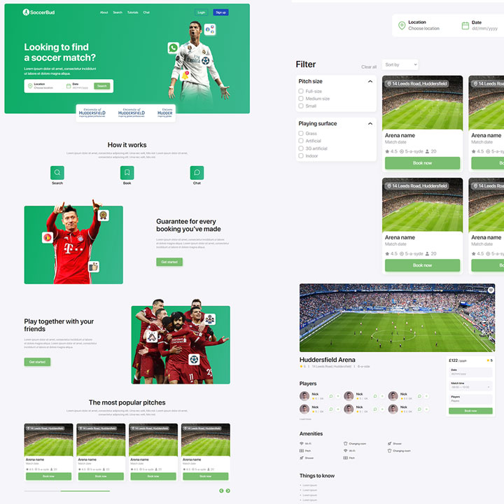

# SoccerBud

Find your perfect football teammates:soccer:

## Description

**What was your motivation?**

I've used to play professional football when I was at school and really got to like this sport. Usually I'd go with my friends and have some matches with adults on a pitch next to my house. When I came in the UK I've met the problem that I don't know anyone and I'm not able to gather a team to play with. I've looked on the internet and Apple Store for applications that would solve this issue and couldn't find one that would allow me to book a match and get in touch with my teammates. So I took this to develop this idea as part of one of my uni projects. 

**Roles**

I was responsible for the design:art: and coding all the Front-end of the project:framed_picture:.

**Why did you build this project?**

I've wanted to develop a website that would help solve my issues and making it as a part of my uni project got me the perfect opportunity to check the MVP and get some feedback and guidance from my tutors.

**What problem does it solve?**

It help football lovers find teammates if they haven't got a lot of frieds. It also helps users find pitches and book matches.

**What did you learn?**

- How to create a MVP 
- How to conduct user research
- How to manage a project top to bottom 
- How to work within an Agile environment
- How to use latest design and Front-end trends
- How to use latest Front-end technologies
- How to test a product
- How to work with GULP
- How to work with SCSS

## Badges

Badges aren't necessary, per se, but they demonstrate street cred. Badges let other developers know that you know what you're doing. Check out the badges hosted by [shields.io](https://shields.io/). You may not understand what they all represent now, but you will in time.

## Features

- Usage of slick sliders
- Using Flexboxes
- Using Grids
- Active usage of position relative and absolute
- Using SCSS variables
- Fully responsive
- Custom checkboxes
- Using and integrated Google map

